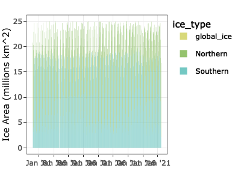
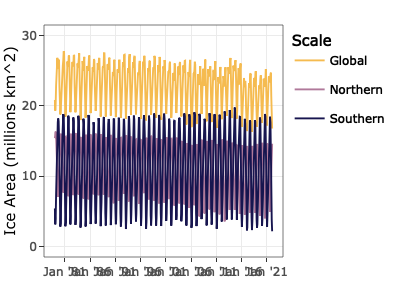
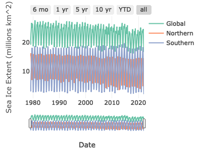

Global Sea Ice EDA and Analysis
================
Jack Rabe
4/28/2022

Load in data

``` r
#load in global data set
globe_ice.df <- read.csv(file = "./data/global_sea_ice_1979-2022.csv", header = TRUE) %>% 
  as_tibble() %>% 
  rename("global_ice" = "Ice",
         "global_anomaly" = "Anomaly")

summary(globe_ice.df)
```

    ##       Date           Date2                Year          Month      
    ##  Min.   :197901   Length:518         Min.   :1979   Min.   : 1.00  
    ##  1st Qu.:198910   Class :character   1st Qu.:1989   1st Qu.: 3.00  
    ##  Median :200008   Mode  :character   Median :2000   Median : 6.00  
    ##  Mean   :200015                      Mean   :2000   Mean   : 6.48  
    ##  3rd Qu.:201105                      3rd Qu.:2011   3rd Qu.: 9.00  
    ##  Max.   :202202                      Max.   :2022   Max.   :12.00  
    ##    global_ice    global_anomaly 
    ##  Min.   :-9999   Min.   :-9999  
    ##  1st Qu.:   20   1st Qu.:   -1  
    ##  Median :   23   Median :    0  
    ##  Mean   :  -16   Mean   :  -39  
    ##  3rd Qu.:   25   3rd Qu.:    0  
    ##  Max.   :   28   Max.   :    2

``` r
#load in northern hemisphere data set
nohem_ice.df <- read.csv(file = "./data/nohem_sea_ice_1979-2022.csv", header = TRUE) %>% 
  as.tibble() %>% 
  rename("nohem_ice" = "Value",
         "nohem_anomaly" = "Anomaly")

summary(nohem_ice.df)
```

    ##       Date           Date2                Year          Month      
    ##  Min.   :197901   Length:519         Min.   :1979   Min.   : 1.00  
    ##  1st Qu.:198910   Class :character   1st Qu.:1989   1st Qu.: 3.00  
    ##  Median :200008   Mode  :character   Median :2000   Median : 6.00  
    ##  Mean   :200019                      Mean   :2000   Mean   : 6.47  
    ##  3rd Qu.:201106                      3rd Qu.:2011   3rd Qu.: 9.00  
    ##  Max.   :202203                      Max.   :2022   Max.   :12.00  
    ##    nohem_ice     nohem_anomaly  
    ##  Min.   :-9999   Min.   :-9999  
    ##  1st Qu.:    9   1st Qu.:   -1  
    ##  Median :   12   Median :    0  
    ##  Mean   :  -27   Mean   :  -39  
    ##  3rd Qu.:   14   3rd Qu.:    0  
    ##  Max.   :   16   Max.   :    1

``` r
#load in southern hemisphere data set
sohem_ice.df <- read.csv(file = "./data/sohem_sea_ice_1979-2022.csv", header = TRUE) %>% 
  as.tibble() %>% 
  rename("sohem_ice" = "Value",
         "sohem_anomaly" = "Anomaly")

summary(sohem_ice.df)
```

    ##       Date           Date2                Year          Month      
    ##  Min.   :197901   Length:519         Min.   :1979   Min.   : 1.00  
    ##  1st Qu.:198910   Class :character   1st Qu.:1989   1st Qu.: 3.00  
    ##  Median :200008   Mode  :character   Median :2000   Median : 6.00  
    ##  Mean   :200019                      Mean   :2000   Mean   : 6.47  
    ##  3rd Qu.:201106                      3rd Qu.:2011   3rd Qu.: 9.00  
    ##  Max.   :202203                      Max.   :2022   Max.   :12.00  
    ##    sohem_ice     sohem_anomaly  
    ##  Min.   :-9999   Min.   :-9999  
    ##  1st Qu.:    6   1st Qu.:    0  
    ##  Median :   12   Median :    0  
    ##  Mean   :  -27   Mean   :  -39  
    ##  3rd Qu.:   17   3rd Qu.:    0  
    ##  Max.   :   20   Max.   :    2

``` r
#join the three dataframes
total_ice.df <- inner_join(globe_ice.df, nohem_ice.df,
                           by = c("Date" = "Date",
                                  "Date2" = "Date2",
                                  "Year" = "Year",
                                  "Month" = "Month")) 
total_ice.df <- inner_join(total_ice.df, sohem_ice.df,
                           by = c("Date" = "Date",
                                  "Date2" = "Date2",
                                  "Year" = "Year",
                                  "Month" = "Month"))

#tidy up data
total_ice.df <- total_ice.df %>% 
  filter(global_ice != -9999) %>% #remove rows with -9999 (no value)
  select(!Date) %>% 
  rename(Date = Date2) %>% 
  mutate(Date = str_replace_all(string = Date, 
                            pattern = "/", 
                            replacement = "-"))

total_ice.df <- total_ice.df %>% 
  mutate(Date = mdy(Date))
  

#check how summary looks now
summary(total_ice.df)
```

    ##       Date                 Year          Month         global_ice  
    ##  Min.   :1979-01-01   Min.   :1979   Min.   : 1.00   Min.   :16.3  
    ##  1st Qu.:1989-11-23   1st Qu.:1989   1st Qu.: 3.00   1st Qu.:20.3  
    ##  Median :2000-08-16   Median :2000   Median : 6.00   Median :23.5  
    ##  Mean   :2000-08-03   Mean   :2000   Mean   : 6.48   Mean   :23.0  
    ##  3rd Qu.:2011-05-08   3rd Qu.:2011   3rd Qu.: 9.00   3rd Qu.:25.3  
    ##  Max.   :2022-02-01   Max.   :2022   Max.   :12.00   Max.   :27.8  
    ##  global_anomaly     nohem_ice     nohem_anomaly      sohem_ice    
    ##  Min.   :-3.720   Min.   : 3.57   Min.   :-3.020   Min.   : 2.16  
    ##  1st Qu.:-0.725   1st Qu.: 8.56   1st Qu.:-0.843   1st Qu.: 5.82  
    ##  Median :-0.100   Median :12.10   Median :-0.185   Median :12.12  
    ##  Mean   :-0.279   Mean   :11.39   Mean   :-0.274   Mean   :11.57  
    ##  3rd Qu.: 0.390   3rd Qu.:14.30   3rd Qu.: 0.340   3rd Qu.:17.02  
    ##  Max.   : 1.650   Max.   :16.34   Max.   : 1.260   Max.   :19.76  
    ##  sohem_anomaly    
    ##  Min.   :-2.1300  
    ##  1st Qu.:-0.3200  
    ##  Median :-0.0350  
    ##  Mean   :-0.0059  
    ##  3rd Qu.: 0.3300  
    ##  Max.   : 1.8500

``` r
str(total_ice.df)
```

    ## tibble [516 × 9] (S3: tbl_df/tbl/data.frame)
    ##  $ Date          : Date[1:516], format: "1979-01-01" "1979-02-01" ...
    ##  $ Year          : int [1:516] 1979 1979 1979 1979 1979 1979 1979 1979 1979 1979 ...
    ##  $ Month         : int [1:516] 1 2 3 4 5 6 7 8 9 10 ...
    ##  $ global_ice    : num [1:516] 20.8 19.3 20.3 22.9 24.7 ...
    ##  $ global_anomaly: num [1:516] 1.39 0.95 0.88 1.4 1.24 1.6 1.4 0.82 0.35 0.13 ...
    ##  $ nohem_ice     : num [1:516] 15.4 16.2 16.3 15.4 13.9 ...
    ##  $ nohem_anomaly : num [1:516] 0.99 0.88 0.91 0.76 0.57 0.76 0.84 0.84 0.64 0.4 ...
    ##  $ sohem_ice     : num [1:516] 5.4 3.14 4 7.49 10.83 ...
    ##  $ sohem_anomaly : num [1:516] 0.4 0.07 -0.03 0.64 0.67 0.84 0.56 -0.02 -0.29 -0.28 ...

Plot temporal trends in global sea ice change

``` r
total_ice_bar.df <- total_ice.df %>% 
  pivot_longer(cols = ends_with("ice"), #taking from wide to long
               names_to = "ice_type", #category = type of event 
               values_to = "area") %>%  #measurement = time till event
  filter(ice_type != "global_hem") %>% 
  mutate(ice_type = as.factor(ice_type) %>% 
           fct_recode("Northern" = "nohem_ice",
                      "Southern" = "sohem_ice"))
  
#make ggplotly  
sea.ice.gg <- total_ice_bar.df %>% 
  ggplot(aes(x = Date, y = area, fill = ice_type)) +
  geom_bar(stat = "identity", position = "stack", size = 1.5) +
  scale_y_continuous(limits = c(0,25)) +
  scale_x_date( #The date equiv of scale_x_continuous
    date_breaks = "5 year", #Breaks
    date_minor_breaks = "1 year", #Little lines in between
    date_labels = "%b '%y" #Label for the date,
  ) +
  xlab("") + ylab("Ice Area (millions km^2)") +
  scale_fill_manual(values = met.brewer("Hokusai3", direction = 1))
  
  

#ggplotly() + tooltip to control label
ggplotly(sea.ice.gg, tooltip = "text") #tooltip controls text hover/label
```



``` r
total_ice_line.df <- total_ice.df %>% 
  pivot_longer(cols = ends_with("ice"), #taking from wide to long
               names_to = "ice_type", #category = type of event 
               values_to = "area") %>%  #measurement = time till event
  mutate(ice_type = as.factor(ice_type) %>% 
           fct_recode("Global" = "global_ice",
                      "Northern" = "nohem_ice",
                      "Southern" = "sohem_ice"))
  
#make ggplotly  
sea.ice.gg <- total_ice_line.df %>% 
  ggplot(aes(x = Date, y = area, color = ice_type, fill = ice_type)) +
  geom_line() +
  scale_y_continuous( limits = c(0,30)) +
  scale_x_date( #The date equiv of scale_x_continuous
    date_breaks = "5 year", #Breaks
    date_minor_breaks = "1 year", #Little lines in between
    date_labels = "%b '%y" #Label for the date,
  ) +
  xlab("") + ylab("Ice Area (millions km^2)") +
  #scale_color_viridis_d("Hemisphere") +
  scale_color_manual("Scale", values = met.brewer("Renoir", n = 3, type = "discrete", direction = -1))
  

#ggplotly() + tooltip to control label
ggplotly(sea.ice.gg, tooltip = "text") #tooltip controls text hover/label
```



``` r
#make plotly
seaice.plotly <- plot_ly(total_ice_line.df, x = ~Date, y = ~area, color = ~ice_type)
seaice.plotly <- seaice.plotly %>% add_lines()
seaice.plotly <- seaice.plotly %>% layout(
    xaxis = list(
      rangeselector = list(
        buttons = list(
          list(
            count = 6,
            label = "6 mo",
            step = "month",
            stepmode = "backward"),
          list(
            count = 1,
            label = "1 yr",
            step = "year",
            stepmode = "backward"),
          list(
          count = 5,
            label = "5 yr",
            step = "year",
            stepmode = "backward"),
          list(
          count = 10,
            label = "10 yr",
            step = "year",
            stepmode = "backward"),
          list(
            count = 1,
            label = "YTD",
            step = "year",
            stepmode = "todate"),
          list(step = "all"))),

      rangeslider = list(type = "date")),
    
    yaxis = list(title = "Sea Ice Extent (millions km^2)"))

seaice.plotly
```


