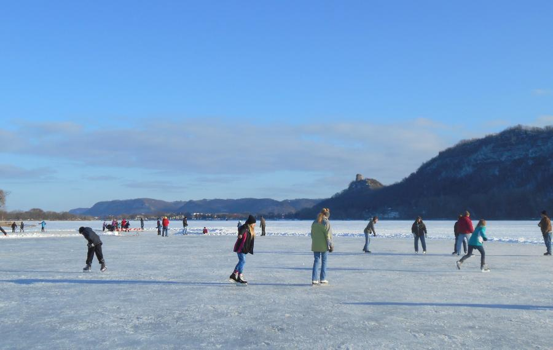

 
The period of ice in the winter is an important part of many northern latitude areas. Ice is important culturally as seen by these people ice skating on a lake in Minnesota. Ice is also important in the life history of many cold dwelling species.  For example, Atlantic cod spend much of their life under sea ice and are important prey species for larger birds, fish and mammals. And of course, we can't forget about the most common example of how sea ice is impacting wildlife, polar bears! Polar bears rely on sea ice for catching their primary prey, seals. Many migratory and breeding birds also rely on the timing of freeze-thaw cycles in lakes. As climate change continues to alter both sea and lake ice patterns, documenting these shifts will be critical for preserving animals as well as human cultures. 

On this website you can find our work to document the effect that climate change has had on both global sea ice and lake ice in the state of Minnesota. Here, we used a combination of citizen science data and data collected from state agencies and collaborative partnerships between the federal government and university scientists. Our work focused on exploring the shifting trends in sea ice and lake ice across space and time. Under the "Minnesota Ice" tab, you will find a dashboard highlighting our analyses and visualizations. We looked at when citizens observed ice forming on the lake (ice on) and when they observed it disappearing (ice off). For each lake we calculated the timing of these events and also the duration between them, looking at any temporal and spatial trends in lake ice. Under the "global" tab, you will find analyses and visualizations based on global and hemispheric sea ice. We examined spatial and temporal trends in sea ice on a monthly and annual scale, as well as how sea ice varies with global temperature change and how sea level varies with changing sea ice. We also utilized daily sea ice extent to calculatew the number of days per year that sea ice was expanding and receding to compare with ice duration trends observed in Minnesota. Feel free to email with any suggestions and improvements!

  
